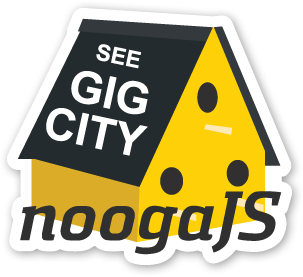

NoogaJS
========

<h3>What is NoogaJS?</h3>
NoogaJS is an open source and JavaScript focused community based in Chattanooga, Tennesee.   

==========
<h3>About Us</h3>
Also known as <a href="http://thegigcity.com" target="_blank">The Gig City</a>, Chattanooga is a vibrant community of starters, artists, designers, and developers who are focused on crowd accelerated innovation and blazing new trails in the future landscape.  In much the same way that <a href="http://thegigcity.com" target="_blank">The Gig City</a> is opening doors to new models of learning, playing, and working on a 600 square mile gigabit-per-second fiber network... JavaScript is just as dramatically changing the way in which we design, deliver, and scale real-time web and mobile applications.  
We started NoogaJS because we are basically workafrolics... we enjoy serving our community... working and playing with all things open source... and of course evangelizing JavaScript!   
In addition to launching NoogaJS in The Gig City, we are very excited that NoogaJS will be running on the absolute best platform available for supporting scalable real-time collaboration and data persistence...

The team at Firebase is absolutely fantastic... in addition to working with the awesomeness that is Firebase... we are honored to have their support of The Gig City JavaScript Community.

Stay tuned... as there is more to come!

Cheers,
<h3>Brian &amp; Andrew</h3>
<h4>(The Starters)</h4>

<h3>The <b>WHY</b></h3>
At <a href="http://8-bit.me" target="_blank">8-Bit Mellow</a> we believe that we all...
<ul>
	<li>- possess a deeply human desire to create and to learn.</li>
	<li>- want to be part of something bigger than ourselves.</li>
	<li>- are driven to share our gifts in the service of others.</li>
	<li>- can change the world by doing better by our community.</li>
</ul>

<h3>So... what's with the name <a href="http://8-Bit.me" target="_blank">8-Bit Mellow</a>?</h3>

They had me at 8-Bit. I grew up with technology in the 1980's and it was my experience with 8-Bit computers and 8-Bit gaming consoles where I first fell in love with technology, design, and open source.

Today, it is way to easy to get distracted… to get caught up in the flow of the day to day grind and pulled away from what you love. A new vision and model for our businesses and organizations needs to emerge which is based on intrinsic motivation and self-direction.

As I look around I see that the world is quickly changing in an incredibly fantastic way where the line between work and play is blurring away and the blending of career and hobby is becoming more possible.  At the end of the day, I am confident that it will be our passion that pushes us to succeed in breaking through brick walls to overcome 21st century challenges.

Hobby Your Day Job, 

-Brian Hooper (Starter | Co-Founder)
